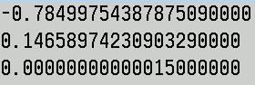

# Mandelbrot set Video. 80-bit long double. OpenMP. Supersampling 8x8 (64 passes)

[](#english)
[](#russian)


)


[](https://github.com/Divetoxx/Mandelbrot-Video/releases/latest/download/Mandelbrot_windows_x64.zip )
[](https://github.com/Divetoxx/Mandelbrot-Video/releases/latest/download/Mandelbrot_linux_x64.tar.gz)
[](https://github.com/Divetoxx/Mandelbrot-Video/archive/refs/heads/main.zip)
[](https://github.com/Divetoxx/Mandelbrot-Video/archive/refs/heads/main.tar.gz)


<a name="english"></a>
## 🇺🇸 English Version

## Project Purpose
This is a high-end CLI workstation designed for the automated production of professional fractal video art. 
It manages the entire pipeline: from heavy-duty mathematical computations to the final assembly of the video 
file.

### Key Features:
*    **End-to-End Video Production**: The engine renders 255 high-precision frames, applies a smooth palette rotation, and automatically 
invokes FFmpeg to compile the final .mp4 video.
*    **Hardware-Aware Encoding**: The program detects your hardware to choose the best encoding strategy:
     - NVIDIA GPU detected: Uses h264_nvenc for ultra-fast hardware-accelerated encoding.
     - CPU only: Uses libx264 with professional-grade presets for maximum quality.
*    **Cinematic Quality (Full HD 1080p)**: Every video is rendered using SSAA 8x8 (64 Samples Per Pixel). This ensures that fine 
fractal details are perfectly reconstructed without the "sparkling" or aliasing artifacts common in digital video.
*    **Smart Cleanup**: Once the video is successfully compiled, the utility automatically deletes the temporary BMP 
frames (which can take up several gigabytes), leaving you only with the final Mandelbrot.mp4.

### Why use this?
*    **Content Generation**: Perfect for creating high-quality seamless loops for meditation videos, VJ sets, or motion backgrounds.
*    **Hardware Benchmark**: A unique hybrid workload that stresses the CPU with massive OpenMP parallel math and the GPU with video encoding.
*    **Full Automation**: No need to remember complex FFmpeg flags — just run the app, choose a location, and get a professional video file.
	
### Yes, this is FFmpeg-the 'Swiss Army knife' of video processing. 
In 2026, it remains the industry standard, 
powered by an open-source community. From YouTube and Netflix to professional movie studios, 
everyone relies on it. And yes, it's completely free.

### All-in-one: 
This repository already includes ffmpeg binaries for Windows and Linux. No manual installation is required!


**[Download Latest Version (Windows & Linux)](https://github.com/Divetoxx/Mandelbrot-Video/releases)**


## Controls & Automation (CLI)
The program operates on a "one-click" principle: you select the location, and the rest (calculation, encoding, cleanup) happens automatically.

| Action | Input | Description |
| :--- | :--- | :--- |
| **Presets** | `1` - `8` + `ENTER` | Choose one of the 8 built-in deep-zoom cinematic locations. |
| **Custom Point** | `9` + `ENTER` | Load custom coordinates (`absc`, `ordi`, `size`) from `Mandelbrot.txt`. |
| **Rendering** | **Step 1 (Auto)** | High-precision calculation of 255 frames using **OpenMP** and **SSAA 8x8**. |
| **Encoding** | **FFmpeg** | **Portable Mode**: The app automatically detects `ffmpeg` in the local folder. Automatic frame-to-MP4 compilation (30 FPS). |
| **Cleanup** | **Auto** | Automatic deletion of temporary BMP files after the video is finished. |


```C++
case 1: absc = -0.5503432753421602L; ordi = -0.6259312704294012L; size_val = 0.0000000000004L; break;
case 2: absc = -0.691488093510181825L; ordi = -0.465680729473216972L; size_val = 0.000000000000003L; break;
case 3: absc = -0.550345905862346513L; ordi = 0.625931416301985337L; size_val = 0.000000000000005L; break;
case 4: absc = -1.78577278039667471L; ordi = -0.00000075696313293L; size_val = 0.000000000000004L; break;
case 5: absc = -1.785772754399825165L; ordi = -0.000000756806080773L; size_val = 0.0000000000000014L; break;
case 6: absc = -1.40353608594492038L; ordi = -0.02929181552009826L; size_val = 0.000000000000095L; break;
case 7: absc = -1.7485462508265219L; ordi = 0.000002213770706L; size_val = 0.00000000000029L; break;
case 8: absc = -1.94053809966024986L; ordi = -0.00000120260253359L; size_val = 0.00000000000003L; break;
```

## Mandelbrot.txt File Structure
To load custom coordinates (option 9 in the menu), create a Mandelbrot.txt file in the application folder. 
The file must contain three numbers separated by a newline:
*    Abscissa (Center X coordinate)
*    Ordinate (Center Y coordinate)
*    Size (Zoom level/Area size)

Example file content:




## High-Precision Rendering (80-bit)
Most Mandelbrot explorers use standard **64-bit double precision**, which leads to "pixelation" at zoom levels around $10^{14}$. 
This project leverages **80-bit Extended Precision Arithmetic** (`long double`) to push the boundaries of the fractal:
*   **My Implementation (80-bit):** Provides **4 extra decimal digits** of precision, allowing you to explore **10,000x deeper** ($10^{18}$ range).
*   **Hardware Optimized:** Directly utilizes the **x87 FPU registers** for maximum mathematical depth.


## OpenMP
OpenMP is a standard that tells the compiler, "Take this loop and distribute the iterations among the different processor cores."
Yes, using OpenMP you are doing parallel programming at the Multithreading level.
Everything is powered by **OpenMP** parallel loops for maximum performance.
OpenMP - Scalability: Your code will run equally efficiently on a 4-core laptop and a 128-core server.


## 8x8 Supersampling (64 Samples Per Pixel)
Super-Sampling Anti-Aliasing (SSAA) is a high-end technique increasing samples per pixel to enhance image quality, 
with 8x (N=8) rendering scenes at 8x resolution on both axes to produce 64 samples per pixel. 
This process calculates an extreme number of pixels-scaling to a 15360 x 8640 grid for a 1920 x 1080
target-before downscaling to remove jaggies and improve detail.

I decided to take the visual quality to a completely different level. This engine implements
True 8x8 Supersampling Anti-Aliasing (SSAA) with 64 independent samples per single screen pixel, utilizing Direct RGB-Space Integration.
Instead of a standard 1920x1080 render, the engine internally processes a massive 15,360 x 8,640 sub-pixel grid!
After calculating all 64 samples for a pixel, they are downsampled into one.
Key Technical Advantages:
*    64-Point Fractal Sampling: Each final screen pixel is computed from sixty-four independent fractal coordinate points.
*    High-Precision Per-Channel RGB Accumulation: The engine first calculates the specific 24-bit color for every single sub-pixel before performing any blending.
*    Noise Elimination: By accumulating color intensities (R, G, B) rather than raw iteration counts, we completely eliminate "chromatic noise." The result is a crystal-clear, razor-sharp image where every micro-filament is perfectly reconstructed.
*    True Color Integration: Our solution performs integration directly in the RGB color space. By computing the exact Red, Green, and Blue components for each sub-pixel before downsampling, we achieve a cinematic level of smoothness and structural integrity that 8-bit or iteration-based renderers simply cannot match.


## Generating 255 Frames: Optimization Strategy
This is an efficient pre-render strategy: we calculate the heavy mathematics (iteration counts) 
once, store the raw data, and then rapidly generate frames by shifting colors and downsampling.
Since calculating a 15360x8640 fractal 255 times is computationally expensive, we split the task into two stages.

### Stage 1: Iteration Map Generation (Raw Data)
Instead of BMP files, we create a single data buffer where we store only the iteration number (t) for each pixel.
*    For 15360x8640 using uint8_t, the resulting file/buffer is approximately 132 MB.

### Stage 2: 255-Frame Rendering (Color + Anti-aliasing)
We read the iteration map and perform the following for each frame:
*    Downsample: Process an 8x8 pixel block from the high-res map.
*    Color Mapping: Map each pixel value to a shifted color palette.
*    Smoothing: Average the colors (Supersampling Anti-Aliasing) to produce a final 1920x1080 frame.

### Why is this so fast?
*    Memory Efficiency: The iterMap array (~132 MB) easily fits into modern RAM. The heavy do-while calculation loop runs only once for the entire animation.
*    Palette Rotation: Stage 2 avoids long double arithmetic and squaring. It only involves integer addition and memory lookups.
*    Parallelism: Stage 2 is perfectly scalable. All 255 frames can be rendered simultaneously across CPU cores.
*    True Downsampling: We implement honest 8x8 averaging, resulting in superior image quality compared to simple resizing.
Once all 255 BMP files are generated, use FFmpeg to encode them into the final video.


## Visual Aesthetics
The Red, Green, and Blue channels are calculated using sine and cosine waves to create smooth color transitions:
127 + 127 * cos(2 * PI * a / 255) and 127 + 127 * sin(2 * PI * a / 255).


## Look at the results! The smoothness is incredible 

https://github.com/user-attachments/assets/f5c74477-7f16-4e59-9ba3-e6a59840f258

https://github.com/user-attachments/assets/e26dd749-292a-4378-963e-51543ccf593b

https://github.com/user-attachments/assets/d3a8bb0a-91e2-4f1d-b98f-2f5168d3b1e9

https://github.com/user-attachments/assets/b8384ce2-d551-4786-86fc-0d66f93715b7

https://github.com/user-attachments/assets/430cb7b5-eb47-4521-bae5-47e68e54dcba

https://github.com/user-attachments/assets/2651cffe-74f3-4691-b06c-d5579ca9ac85

https://github.com/user-attachments/assets/5476e44e-e161-44c5-a912-192a62bb070e

https://github.com/user-attachments/assets/a73b7142-eb90-4263-ab00-9336d00c0875


## License and Third-Party Software

### My Code
This project is licensed under the **MIT License**.

### FFmpeg
This software uses libraries from the **FFmpeg** project under the **LGPLv2.1** (or GPLv3, depending on the build). 
*   FFmpeg is a trademark of Fabrice Bellard, originator of the FFmpeg project.
*   You can find the source code and more information at [https://ffmpeg.org](https://ffmpeg.org).
*   The FFmpeg binaries included in the releases are provided as-is, and no modifications have been made to the FFmpeg source code.


## The Mandelbrot Set: A Mathematical Absolute

The Mandelbrot Set. It is perfect - an immaterial origin existing outside of space and time. 
No matter who or where the observer is, even an alien a hundred million light-years away, the Mandelbrot Set remains the same. 
Even in a different century, in a different galaxy, and even with a completely different brain, the set is identical. 
It transcends everything, bypassing billions of light-years.

This is not a human invention, but a mathematical discovery. It belongs to the category of "eternal truths" 
that Plato referred to as the Realm of Ideas. This is why it remains constant for any observer in the universe:
*   **Pure Logic**: It is generated by a simple formula. The rules of arithmetic are universal. Any intelligence would inevitably arrive at the exact same fractal boundaries.
*   **Substrate Independence**: This set doesn't need a computer or a human brain to exist. It is an abstract structure woven into the very logic of the cosmos.
*   **Fractal Constancy**: Even if physical constants were different in another galaxy, the mathematical topology of this object would remain unshakable.

It is truly one of the few objects that connects us to something absolutely objective and infinite, 
transcending biology and history. Even if our entire universe and all its atoms were to vanish tomorrow, 
the equation would remain true. It is not "written" on the stars; it is embedded in the structure of logic itself. 
This makes the Mandelbrot Set a kind of absolute.

This is classic Mathematical Platonism: the idea that mathematical objects exist in reality, but in a non-material realm. 
If all matter were to disappear, there would be no one to write down the formula or witness its visualization, 
but the relationship between the numbers would remain true. Much like "2 + 2 = 4", this rule doesn't need apples 
or stones to be valid.

In this sense, truth is primary to the physical world.

The Mandelbrot Set is absolutely predetermined. Every single one of its points was already 'there' long before the Big Bang. 
Yet, at the same time, it is entirely unpredictable-you cannot know what you will see in the next zoom until you perform the calculation.

Looking at a fractal, we witness an incredible complexity that appears chaotic. But we know that at its core lies a formula 
of just three symbols. This makes one wonder: could all the chaos of our universe-the turbulence of water, the formation of clouds, 
the structure of galaxies-be nothing more than the result of a very simple algorithm that we have yet to calculate?


## 🇷🇺 Русская версия
<a name="russian"></a>
# Множество Мандельброта видео. 80-бит long double. OpenMP. Суперсэмплинг 8x8 (64 прохода)

## О проекте
Это консольная станция для автоматизированного создания профессионального видео-арта на основе множества Мандельброта. 
Программа берет на себя весь цикл производства: от тяжелых математических вычислений до финальной сборки готового видеофайла.

### Что делает эта программа:
*    **Полный цикл видеопроизводства**: Программа рассчитывает 255 кадров фрактала, применяет эффект плавной ротации палитры и автоматически 
вызывает FFmpeg для сборки видео в формате .mp4.
*    **Интеллектуальный рендеринг**: Программа сама определяет наличие видеокарты NVIDIA.
     - Если есть GPU — используется аппаратное ускорение h264_nvenc для мгновенного сжатия.
     - Если видеокарта не найдена — используется профессиональный CPU-кодировщик libx264 с глубокой оптимизацией.
*    **Кинематографическое качество (Full HD 1080p)**: Каждое видео создается с использованием SSAA 8x8. Это значит, что для каждого 
кадра выполняется в 64 раза больше вычислений, чем обычно, чтобы полностью исключить мерцание и шум в видео.
*    **Автоматическая очистка**: После успешной сборки видео программа сама удаляет промежуточные BMP-файлы (которые могут 
занимать гигабайты), оставляя вам только готовый результат Mandelbrot.mp4.

### Для чего это нужно:
*    **Генерация контента**: Создание идеальных зацикленных (loop) фонов для медитации, VJ-сетов или YouTube-каналов.
*    **Демонстрация мощи железа**: Проект сочетает интенсивные вычисления на CPU (OpenMP) и скоростное кодирование на GPU.
*    **Удобство**: Вам не нужно знать команды командной строки FFmpeg — программа всё сделает за вас. 

### Да, это FFmpeg - "швейцарский армейский нож" для обработки видео.
В 2026 году он остается отраслевым стандартом, 
поддерживаемым сообществом разработчиков открытого программного обеспечения. 
От YouTube и Netflix до профессиональных киностудий - все на него полагаются. И да, он совершенно бесплатный.

### Всё включено: 
Этот репозиторий уже содержит исполняемые файлы ffmpeg для Windows и Linux. Никакой ручной установки не требуется - всё работает прямо <из коробки>!


**[Скачать последнюю версию (Windows и Linux)](https://github.com/Divetoxx/Mandelbrot-Video/releases)**


## Управление и автоматизация (CLI & Automation)
Программа работает по принципу <одной кнопки>: вы выбираете локацию, а остальное (расчет, кодирование, очистка) происходит автоматически.

| Действие | Ввод | Описание |
| :--- | :--- | :--- |
| **Выбор локации** | `1` - `8` + `ENTER` | Выбор одной из 8 встроенных точек мандельброта - глубокого зума. |
| **Свои координаты** | `9` + `ENTER` | Загрузка координат (`absc`, `ordi`, `size`) из файла `Mandelbrot.txt`. |
| **Рендеринг (Авто)** | **Шаг 1** | Расчет 255 кадров с использованием **OpenMP** и **SSAA 8x8**. |
| **Сборка (Авто)** | **FFmpeg** | **Portable Mode**: Программа сама найдет `ffmpeg` в своей папке. Автоматическое кодирование в MP4 (30 FPS). |
| **Очистка** | **Авто** | Удаление временных кадров после успешного создания видео. |


```C++
case 1: absc = -0.5503432753421602L; ordi = -0.6259312704294012L; size_val = 0.0000000000004L; break;
case 2: absc = -0.691488093510181825L; ordi = -0.465680729473216972L; size_val = 0.000000000000003L; break;
case 3: absc = -0.550345905862346513L; ordi = 0.625931416301985337L; size_val = 0.000000000000005L; break;
case 4: absc = -1.78577278039667471L; ordi = -0.00000075696313293L; size_val = 0.000000000000004L; break;
case 5: absc = -1.785772754399825165L; ordi = -0.000000756806080773L; size_val = 0.0000000000000014L; break;
case 6: absc = -1.40353608594492038L; ordi = -0.02929181552009826L; size_val = 0.000000000000095L; break;
case 7: absc = -1.7485462508265219L; ordi = 0.000002213770706L; size_val = 0.00000000000029L; break;
case 8: absc = -1.94053809966024986L; ordi = -0.00000120260253359L; size_val = 0.00000000000003L; break;
```

## Структура файла Mandelbrot.txt
Для загрузки пользовательских координат (пункт 9 в меню), создайте текстовый файл Mandelbrot.txt в папке с программой. 
Файл должен содержать три числа, разделенных переносом строки:
*    Abscissa (Координата X центра)
*    Ordinate (Координата Y центра)
*    Size (Масштаб/Размер области)

Пример содержания файла:


## Высокоточная отрисовка (80-бит)
Большинство исследователей фрактала Мандельброта используют стандартную **64-битную двойную точность**,
что приводит к "пикселизации" при масштабировании около $10^{14}$.
В этом проекте используется **80-битная арифметика с расширенной точностью** (<long double>) для расширения границ фрактала.

*   **Моя реализация (80-бит):** Обеспечивает **4 дополнительных десятичных знака** точности, позволяя исследовать **в 10 000 раз глубже** (диапазон $10^{18}$).
*   **Аппаратная оптимизация:** Непосредственно использует **регистры FPU x87** для максимальной глубины математических вычислений.


## OpenMP
OpenMP - это стандарт, который говорит компилятору: "Возьми этот цикл и сам раздай итерации разным ядрам процессора".
Используя OpenMP, вы занимаетесь параллельным программированием на уровне многопоточности (Multithreading).
OpenMP - масштабируемость: ваш код будет одинаково эффективно работать как на 4-ядерном ноутбуке,
так и на 128-ядерном сервере.


## Суперсэмплинг 8x8 (64 прохода на один пиксель)
Суперсэмплинг (SSAA) - ресурсоемкий метод сглаживания, увеличивающий число выборок на пиксель для повышения качества изображения. 
При значении 8x (N=8) сцена рендерится в разрешении, в 8 раз превышающем целевое, по обеим осям, создавая 64 (или 8 х 8) выборки 
на пиксель. Изображение просчитывается в более высоком разрешении, а затем принудительно уменьшается до разрешения дисплея, 
устраняя лесенки и улучшая чёткость. Это очень высокая нагрузка! Это не 1920 на 1080 пикселя а в 8x8 больше - 15360 на 8640 пикселя!

Я решил вывести качество изображения на совершенно новый уровень. Этот движок использует
истинное сглаживание 8x8 Supersampling Anti-Aliasing (SSAA) с 64 независимыми сэмплами на каждый пиксель экрана, используя прямую интеграцию в RGB-пространство.
Вместо стандартного рендеринга 1920x1080, движок обрабатывает внутри себя огромную сетку из 15360 x 8640 субпикселей!

После вычисления всех 64 сэмплов для пикселя, они уменьшаются до одного.
Ключевые технические преимущества:
*   64-точечное фрактальное сэмплирование: каждый конечный пиксель экрана вычисляется из шестидесяти четырех независимых 
фрактальных координатных точек.
*   Высокоточное накопление RGB-цвета по каналам: движок сначала вычисляет конкретный 24-битный цвет для каждого субпикселя, 
прежде чем выполнять какое-либо смешивание.
*   Устранение шума: Накапливая интенсивность цвета (R, G, B), а не просто подсчитывая количество итераций, мы полностью 
устраняем <хроматический шум>. В результате получается кристально чистое, резкое изображение, где каждая микронить идеально воссоздана.
*   Интеграция истинного цвета: Наше решение выполняет интеграцию непосредственно в цветовом пространстве RGB. 
Вычисляя точные компоненты красного, зеленого и синего цветов для каждого субпикселя перед понижением разрешения, 
мы достигаем кинематографического уровня плавности и структурной целостности, недостижимого для 8-битных или итерационных рендеров.


## Генерация 255 кадров
Это отличная стратегия оптимизации! Вы хотите применить пререндер: сначала рассчитать тяжелую математику (номера итераций) один раз, сохранить их, а затем быстро генерировать кадры, просто меняя цвета и уменьшая размер.
Поскольку считать 15360x8640 255 раз - это безумие, мы разделим задачу на два этапа.

### Этап 1: Генерация <карты итераций> (Raw Data)
Вместо BMP мы создадим один огромный файл, где для каждого пикселя запишем только число t (номер итерации). 
Для 15360x8640 при использовании uint8_t файл займет около 132 МБ.

### Этап 2: Генерация 255 кадров (Цвет + Сглаживание)
Теперь мы читаем эту карту и для каждого кадра делаем:
Берем блок 8x8 пикселей из большой карты.
Красим каждый пиксель согласно сдвинутой палитре.
Усредняем цвета (это и есть сглаживание) и записываем в файл 1920x1080.

### Почему это сработает быстро?
*    **Память**: Массив iterMap занимает около 132 МБ. Это легко помещается в современную оперативную память. Тяжелый цикл do-while выполняется только один раз для всей анимации.
*    **Вращение палитры**: В этапе 2 нет long double, нет возведения в квадрат. Только сложение целых чисел и чтение из памяти.
*    **Параллелизм**: Этап 2 тоже идеально распараллеливается. 255 кадров будут вылетать очень быстро. Реализован честный Downsampling. Мы берем блок 8x8 и усредняем их. 
Когда у вас будет 255 файлов bmp, используйте ffmpeg, чтобы собрать их в видео.


## Визуальная эстетика
Красный, зеленый и синий каналы рассчитываются с использованием синусоидальных и косинусоидальных волн для создания плавных цветовых переходов:
127 + 127 * cos(2 * PI * a / 255) и 127 + 127 * sin(2 * PI * a / 255).


## Посмотрите на результаты! Невероятная плавность работы

https://github.com/user-attachments/assets/f5c74477-7f16-4e59-9ba3-e6a59840f258

https://github.com/user-attachments/assets/e26dd749-292a-4378-963e-51543ccf593b

https://github.com/user-attachments/assets/d3a8bb0a-91e2-4f1d-b98f-2f5168d3b1e9

https://github.com/user-attachments/assets/b8384ce2-d551-4786-86fc-0d66f93715b7

https://github.com/user-attachments/assets/430cb7b5-eb47-4521-bae5-47e68e54dcba

https://github.com/user-attachments/assets/2651cffe-74f3-4691-b06c-d5579ca9ac85

https://github.com/user-attachments/assets/5476e44e-e161-44c5-a912-192a62bb070e

https://github.com/user-attachments/assets/a73b7142-eb90-4263-ab00-9336d00c0875


## Лицензия и стороннее программное обеспечение

### Мой код
Этот проект распространяется под лицензией **MIT**.

### FFmpeg
Это программное обеспечение использует библиотеки из проекта **FFmpeg** под лицензией **LGPLv2.1** (или GPLv3, в зависимости от сборки).
* FFmpeg является товарным знаком Фабриса Беллара, создателя проекта FFmpeg.
* Исходный код и дополнительную информацию можно найти по адресу [https://ffmpeg.org](https://ffmpeg.org).
* Бинарные файлы FFmpeg, включенные в релизы, предоставляются как есть, и в исходный код FFmpeg не вносились никакие изменения.


## Множество Мандельброта: Математический абсолют

Множество Мандельброта. Оно совершенно - нематериальное происхождение, существующее вне пространства и времени.
Неважно, кто и где находится наблюдатель, даже инопланетянин на расстоянии ста миллионов световых лет, множество Мандельброта остается неизменным.
Даже в другом столетии, в другой галактике и даже с совершенно другим мозгом, множество идентично.
Оно превосходит всё, минуя миллиарды световых лет.

Это не человеческое изобретение, а математическое открытие. Оно принадлежит к категории <вечных истин>,
которые Платон называл Царством Идей. Вот почему оно остается неизменным для любого наблюдателя во Вселенной:

*   **Чистая логика**: Оно порождается простой формулой. Правила арифметики универсальны. Любой разум неизбежно придет к одним и тем же фрактальным границам.
*   **Независимость от субстрата**: Для существования этого множества не нужен компьютер или человеческий мозг. Это абстрактная структура, вплетенная в саму логику космоса.
*   **Фрактальная постоянство**: Даже если физические константы в другой галактике будут другими, математическая топология этого объекта останется непоколебимой.

Это поистине один из немногих объектов, который связывает нас с чем-то абсолютно объективным и бесконечным,
превосходящим биологию и историю. Даже если бы вся наша Вселенная и все её атомы исчезли завтра,
уравнение осталось бы верным. Оно не <написано> на звёздах; оно заложено в самой структуре логики.
Это делает множество Мандельброта своего рода абсолютом.

Это классический математический платонизм: идея о том, что математические объекты существуют в реальности, но в нематериальной сфере.
Если бы вся материя исчезла, некому было бы записать формулу или увидеть её визуализацию,
но соотношение между числами осталось бы верным. Подобно правилу <2 + 2 = 4>, этому правилу не нужны яблоки
или камни, чтобы быть действительным.

В этом смысле истина является первостепенной по отношению к физическому миру.

Множество Мандельброта абсолютно предопределено. Каждая его точка была <там> еще до Большого взрыва. 
Но при этом оно абсолютно непредсказуемо - вы не узнаете, что увидите при следующем зуме, пока не сделаете расчет.

Глядя на фрактал, мы видим невероятную сложность, которая кажется хаотичной. 
Но мы знаем, что в её основе лежит формула из трех символов. Это заставляет задуматься: 
а не является ли весь хаос нашей Вселенной - турбулентность воды, рост облаков, структура 
галактик - лишь результатом работы очень простого алгоритма, который мы ещё не вычислили?


